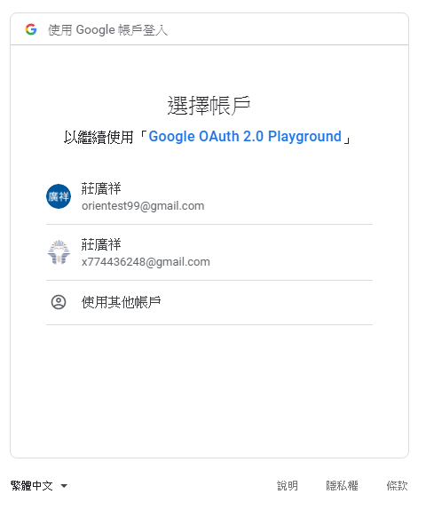
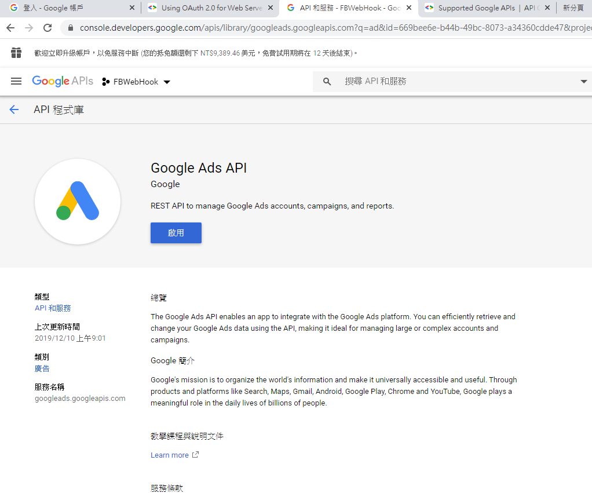
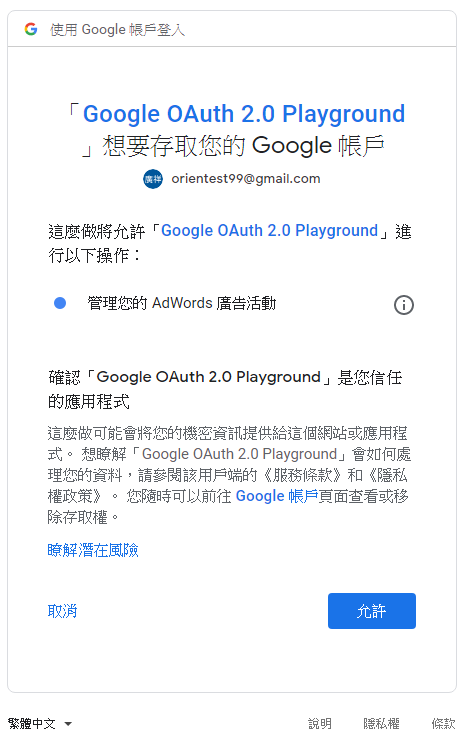

# 如何建立開啟Google OAuth授權的url

## What is OAuth
首先要了解甚麼是 *OAuth*

### 場景
Client-Server架構中,Client向Server出示使用者(Resource Owner)帳號密碼取得受保護資源(Protected Resource)。
若第三方也要取得Resources,則Resource Owner亦需將帳號密碼給予第三方,造成以下問題:

1. 第三方取得帳號密碼，明碼儲存
2. Server需支援密碼認證
3. 第三方幾乎全能
4. Resource Owner無法撤回第三方使用權,除非更改密碼
5. 第三方被破解

### OAuth 解法
1. 引入認證層(authorization layer)
2. 分離client(第三方)與resource owner

- 流程
  1. Resource存放於Resource Server上
  2. Client索取存取權限,存取Resource owner資源
  3. Client取得不同於Resource Owner所持有的驗證碼(credential)
  4. Client取得一個Access Token存取Protected Resources(非Resource Owner帳號密碼)
  5. Access Token 為字串，記載特定的存取範圍,時效等
  6. Access Token 來自 Authorization Server,取得前會得到Resource Owner許可

### OAuth2.0
#### 角色定義
- Resource Owner - 可以授權別人存取Protected Resource,若是人類,即為用戶
- Resource Server - 存放Protected Resource 的伺服器,根據Access Token接受對Resource的請求
- Client 代表Resource Owner 存取Protected Resource(etg., 第三方)
- Authorization Server - 驗證Resource Owner並Resource Owner許可後,派發Access Token的伺服器

```txt
抽象流程：
+--------+                               +---------------+
|        |--(A)- Authorization Request ->|   Resource    |
|        |                               |     Owner     |
|        |<-(B)-- Authorization Grant ---|               |
|        |                               +---------------+
|        |
|        |                               +---------------+
|        |--(C)-- Authorization Grant -->| Authorization |
| Client |                               |     Server    |
|        |<-(D)----- Access Token -------|               |
|        |                               +---------------+
|        |
|        |                               +---------------+
|        |--(E)----- Access Token ------>|    Resource   |
|        |                               |     Server    |
|        |<-(F)--- Protected Resource ---|               |
+--------+                               +---------------+
```

#### Authorization Grant授權許可
Authorization Grant 代表 Resource Owner 授權 Client 可以去取得 Access Token 來存取 Protected Resource。

#### Access Token
用以存取Protected Resource,為字串,代表特定scope,時效。

#### 存取Protected Resource
1. Client 向 Resource Sercer 出示 Access Token 
2. 通常為 Ahtorization header 搭配 Access Token定義的auth schema(etg., Bearer)
3. Resource Server 驗證 Access Token 並確認未過期、scope、及要存取的resource

***

## 在網頁中獲得使用者的OAuth授權
在現今第三方網頁(etg,. Udemy/CodePen...)普遍應用OAuth獲得使用者授權,以取得使用者儲存在Google的資源(帳號信箱/雲端硬碟...),起始畫面一般如下:



往上溯源,我們需要在網頁中產生按鈕/超連結,以開啟上面的授權畫面,關鍵點在於我們需要一串**url**,告訴Google是**誰(Client)**以及要取得**甚麼授權(Scope)**,我們可以在[OAuth 2.0 Playground](https://developers.google.com/oauthplayground/)中產生取得特定授權的url(用以測試)。

例如**我們(Client)**需要使用者授權我們(ADHero)取得他的**Adwords資料(Scope)**,url會長這樣:

```txt
https://accounts.google.com/signin/oauth/oauthchooseaccount?redirect_uri=https%3A%2F%2Fdevelopers.google.com%2Foauthplayground&prompt=consent&response_type=code&client_id=407408718192.apps.googleusercontent.com&scope=https%3A%2F%2Fwww.googleapis.com%2Fauth%2Fadwords&access_type=offline&o2v=2&as=-RhcXCAnlB4ZP0sSuWxA2w&flowName=GeneralOAuthFlow
```

觀察這個url,我們初步了解是透過**Query String**來告訴Google是**誰**以及要取得**甚麼授權**,一旦格式正確,Google便會產生上面的網頁請使用者確定要不要授權給**我們**,一旦完成授權,我們便可以取得**Access Token**,透過API的方式取得用戶授權我們取用的資料。

***
## 實作流程(網頁應用)
[眾裡尋他千百度,我先幫你找到了](https://developers.google.com/identity/protocols/oauth2/web-server)

### 預先需求

#### 你的Google專案需要啟用你想使用的APIs
1. [在Console中開啟API總表](https://console.developers.google.com/apis/library)
2. 選擇要使用的Google專案
3. 選擇要啟用的API(例:ADWords)
4. 點選**啟用**


#### 建立授權憑證(Authorization Credentials)
你需要先讓Google的OAuth2.0伺服器認識你的專案,步驟如下:
1. 開啟[憑證頁面](https://console.developers.google.com/apis/credentials)
2. 點擊**建立憑證** => **OAuth用戶端ID**
3. 選取**網路應用程式**
4. 在**已授權的重新導向 URI**中輸入**重導向url**,這很重要,Google會在用戶完成授權時將**Authorization Code**傳遞到這個url,這意味你需要建立一個**後端Service**監聽Google的呼叫
5. 建立完成後你可以**下載組態檔(json)**,請不要讓他曝露在任何地方,格式大約如下
```json
{
    "web": {
        "client_id": "專案下取得使用者授權的第三方ID",
        "project_id": "專案ID",
        "auth_uri": "https://accounts.google.com/o/oauth2/auth",
        "token_uri": "https://oauth2.googleapis.com/token",
        "auth_provider_x509_cert_url": "https://www.googleapis.com/oauth2/v1/certs",
        "client_secret": "專案下取得使用者授權的第三方Secret",
        "redirect_uris": [
            "完成授權後Google會呼叫的端點(你的後端Service)"
        ]
    }
}
```

### 獲得AccessToken
步驟大致為下:
1. 你的應用程式標示出他所需要的授權
2. 你的應用程式將使用者引導到Google授權頁面
3. 使用者決定是否授權給你的應用程式
4. 你的應用程式知道使用者的決定
5. 如果使用者授權,你的應用程式會獲得**Access Token**

#### 步驟1:建立授權參數(Query String)
透過url的Query String標示出你的應用程式需要使用者授權的項目。
下列為url所使用的參數(Query String)-僅列出較重要的
1. client_id(必須)-你的Google專案下用以獲得使用者授權的第三方ID
2. redirect_uri(必須)-使用者完成授權後將使用者導入的頁面(會包含Google給你的Authorization Code),必須是**建立授權憑證**時建立的重導向url之一
3. response_type(必須)-Google是否會傳遞Authorization Code
4. scope(必須)-你的應用程式將索取的授權,這組參數會決定使用者看到的授權畫面,可以用"+"號連結多個
5. access_type(建議)-指出你的應用程式是否在使用者離線時能重新取得Access Token
   1. 若為online(預設),禁止重新取得Access Token
   2. 若為offline,Google會回傳**refresh token**用以重新取得Access Token
6. 記得這些參數的值若為url,需要先進行**Url Encode**

使用者點擊連結後便會開啟以下頁面:


#### 步驟2:重導向到OAuth2.0的伺服器
依照上面的參數,可以組成url如下
```txt
https://accounts.google.com/o/oauth2/v2/auth?
 scope=https%3A//www.googleapis.com/auth/drive.metadata.readonly&
 access_type=offline&
 include_granted_scopes=true&
 response_type=code&
 state=state_parameter_passthrough_value&
 redirect_uri=https%3A//oauth2.example.com/code&
 client_id=client_id
```
使用者開啟上面的url,便會開啟授權畫面,一旦使用者同意,Google便會將Authorization Code傳遞到**redirect_uri**

#### 步驟3:Google確定使用者是否同意授權
Google會展示你的應用程式索求的授權,畫面如下:


#### 步驟4:控制OAuth2.0伺服器的回應
Google OAuth2.0伺服器會調用你在url裡的redirect_uri回應授權結果。
若使用者同意授權,會應會將authorization code作為Query String傳遞,相反則包含error message,回應如下。
1. 使用者同意
```txt
https://oauth2.example.com/auth?code=4/P7q7W91a-oMsCeLvIaQm6bTrgtp7
```
2. 使用者不同意
```txt
https://oauth2.example.com/auth?error=access_denied
```

#### 步驟5:用Authorization Code交換Access Token
當你的Service收到Authorization Code後,加入以下參數以交換Access Token。
1. client_id(必須)-你的Google專案下用以獲得使用者授權的第三方ID
2. client_secret(必須)-你的Google專案下用以獲得使用者授權的第三方Secret
3. code(必須)-收到的Authorization Code
4. grant_type(必須)-指名授權類型,值為**authorization_code**
5. redirect_uri(必須)-相同於步驟1的redirect_uri(用途不明)

Request如下
```txt
POST /token HTTP/1.1
Host: oauth2.googleapis.com
Content-Type: application/x-www-form-urlencoded

code=4/P7q7W91a-oMsCeLvIaQm6bTrgtp7&
client_id=your_client_id&
client_secret=your_client_secret&
redirect_uri=https%3A//oauth2.example.com/code&
grant_type=authorization_code
```

Google最後會回應json,若步驟1的access_type為**offline**,則會包含**refresh token**。
json參數如下:
1. access_token-千辛萬苦,終於得到
2. expires_in-過期剩餘秒數
3. refresh_token-用以重新獲得access_token
4. scope-你所得到的授權
5. token_type-token類型

json如下
```json
{
  "access_token": "1/fFAGRNJru1FTz70BzhT3Zg",
  "expires_in": 3920,
  "token_type": "Bearer",
  "scope": "https://www.googleapis.com/auth/drive.metadata.readonly",
  "refresh_token": "1//xEoDL4iW3cxlI7yDbSRFYNG01kVKM2C-259HOF2aQbI"
}
```

#### 告一段落
由上步驟最終可以獲得Access Token,至於怎麼透過他呼叫API,則是下一步的研究。